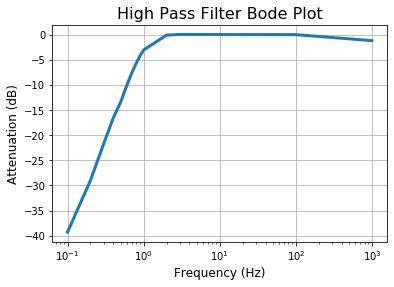
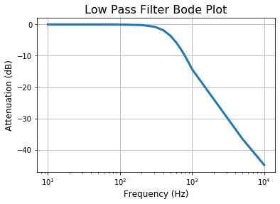

```python
%reset
%matplotlib inline
import matplotlib.pyplot as plt

#IPython is what you are using now to run the notebook
import IPython
print ("IPython version:      %6.6s (need at least 6.1.0)" % IPython.__version__)

# Numpy is a library for working with Arrays
import numpy as np
print ("Numpy version:        %6.6s (need at least 1.13.1)" % np.__version__)

# SciPy implements many different numerical algorithms
import scipy as sp
print ("SciPy version:        %6.6s (need at least 0.19.1)" % sp.__version__)
```

    Once deleted, variables cannot be recovered. Proceed (y/[n])?  y


    IPython version:       7.8.0 (need at least 6.1.0)
    Numpy version:        1.17.2 (need at least 1.13.1)
    SciPy version:         1.3.1 (need at least 0.19.1)


```python
# Set font sizes
SMALL_SIZE = 10
MEDIUM_SIZE = 12
BIGGER_SIZE = 14
plt.rc('font', size=SMALL_SIZE)          # controls default text sizes
plt.rc('axes', titlesize=SMALL_SIZE)     # fontsize of the axes title
plt.rc('axes', labelsize=MEDIUM_SIZE)    # fontsize of the x and y labels
plt.rc('xtick', labelsize=SMALL_SIZE)    # fontsize of the tick labels
plt.rc('ytick', labelsize=SMALL_SIZE)    # fontsize of the tick labels
plt.rc('legend', fontsize=SMALL_SIZE)    # legend fontsize
plt.rc('figure', titlesize=BIGGER_SIZE)  # fontsize of the figure title
```


```python
# import data
hpf_data = np.loadtxt('./HPF.csv',delimiter=',',skiprows=1)
lpf_data = np.loadtxt('./LPF.csv',delimiter=',',skiprows=1)

# reformat data
hpf_data = np.stack(hpf_data, axis=1)
lpf_data = np.stack(lpf_data, axis=1)
```


```python
hpf_dBs = 20*np.log10(hpf_data[1]/hpf_data[2])
lpf_dBs = 20*np.log10(lpf_data[1]/lpf_data[2])
```


```python
plt.xscale('log')
plt.grid()
plt.title('High Pass Filter Bode Plot',fontsize=16)
plt.xlabel('Frequency (Hz)')
plt.ylabel('Attenuation (dB)')
plt.plot(hpf_data[0,1:],hpf_dBs[1:],linewidth=3)
plt.savefig('HPF_Bode.pdf')
```





```python
plt.xscale('log')
plt.grid()
plt.title('Low Pass Filter Bode Plot',fontsize=16)
plt.xlabel('Frequency (Hz)')
plt.ylabel('Attenuation (dB)')
plt.plot(lpf_data[0,1:],lpf_dBs[1:],linewidth=3)
plt.savefig('LPF_Bode.pdf')
```




