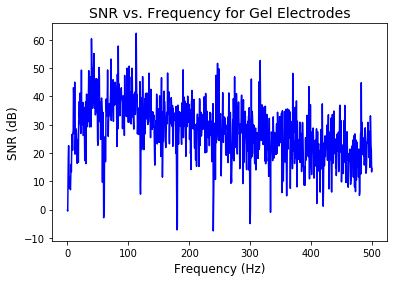
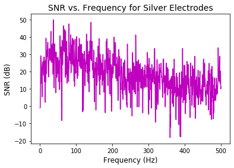

```python
%reset
%matplotlib inline
import matplotlib.pyplot as plt

#IPython is what you are using now to run the notebook
import IPython
print ("IPython version:      %6.6s (need at least 6.1.0)" % IPython.__version__)

# Numpy is a library for working with Arrays
import numpy as np
print ("Numpy version:        %6.6s (need at least 1.13.1)" % np.__version__)

# SciKit Learn implements several Machine Learning algorithms
import sklearn
print ("Scikit-Learn version: %6.6s (need at least 0.19.0)" % sklearn.__version__)
```

    Once deleted, variables cannot be recovered. Proceed (y/[n])?  y


    IPython version:       7.8.0 (need at least 6.1.0)
    Numpy version:        1.17.2 (need at least 1.13.1)
    Scikit-Learn version: 0.22.1 (need at least 0.19.0)


```python
# Set font sizes
SMALL_SIZE = 10
MEDIUM_SIZE = 12
BIGGER_SIZE = 14
plt.rc('font', size=SMALL_SIZE)          # controls default text sizes
plt.rc('axes', titlesize=SMALL_SIZE)     # fontsize of the axes title
plt.rc('axes', labelsize=MEDIUM_SIZE)    # fontsize of the x and y labels
plt.rc('xtick', labelsize=SMALL_SIZE)    # fontsize of the tick labels
plt.rc('ytick', labelsize=SMALL_SIZE)    # fontsize of the tick labels
plt.rc('legend', fontsize=SMALL_SIZE)    # legend fontsize
plt.rc('figure', titlesize=BIGGER_SIZE)  # fontsize of the figure title
```


```python
# import data
gel_relaxed1 = np.loadtxt('./csv/gel_relaxed1.csv',delimiter=',',usecols=(0,1,3,4),skiprows=21)
gel_relaxed2 = np.loadtxt('./csv/gel_relaxed2.csv',delimiter=',',usecols=(0,1,3,4),skiprows=21)
gel_clenched1 = np.loadtxt('./csv/gel_clenched1.csv',delimiter=',',usecols=(0,1,3,4),skiprows=21)
gel_clenched2 = np.loadtxt('./csv/gel_clenched2.csv',delimiter=',',usecols=(0,1,3,4),skiprows=21)
silver_relaxed = np.loadtxt('./csv/silver_relaxed.csv',delimiter=',',usecols=(0,1,3,4),skiprows=21)
silver_clenched_BAD = np.loadtxt('./csv/silver_clenched_BAD.csv',delimiter=',',usecols=(0,1,3,4),skiprows=21)
silver_clenched_better = np.loadtxt('./csv/silver_clenched_better.csv',delimiter=',',usecols=(0,1,3,4),skiprows=21)
```


```python
# Calculate SNR for gel
SNR_gel1 = gel_clenched1[:,3] - gel_relaxed1[:,3]
SNR_gel2 = gel_clenched2[:,3] - gel_relaxed2[:,3]

# plot SNR data
plt.figure(1)
plt.title("SNR vs. Frequency for Gel Electrodes", fontsize=14)
plt.xlabel("Frequency (Hz)")
plt.ylabel("SNR (dB)")
plt.plot(gel_clenched2[:2000,2],SNR_gel2[:2000], 'b-')
plt.savefig('SNR_Gel.pdf')
```





```python
# Calculate the mean SNR from 0-500 Hz for gel

gel_mean_500Hz_1 = np.mean(SNR_gel1[:2000])
gel_mean_500Hz_2 = np.mean(SNR_gel2[:2000])
gel_mean_500Hz = np.mean([gel_mean_500Hz_1, gel_mean_500Hz_2])

gel_std_500Hz_1 = np.std(SNR_gel1[:2000])
gel_std_500Hz_2 = np.std(SNR_gel2[:2000])
gel_std_500Hz = np.mean([gel_std_500Hz_1, gel_std_500Hz_2])

print('Mean SNR from 0-500 Hz for gel electrodes: ' + str(gel_mean_500Hz) + ' dB')
print('Standard deviation of SNR from 0-500 Hz for gel electrodes: ' + str(gel_std_500Hz) + ' dB')
```

    Mean SNR from 0-500 Hz for gel electrodes: 24.053194375 dB
    Standard deviation of SNR from 0-500 Hz for gel electrodes: 9.85431908596908 dB


```python
# Calculate SNR for silver
SNR_silver = silver_clenched_better[:,3] - silver_relaxed[:,3]

# plot SNR data
plt.figure(1)
plt.title("SNR vs. Frequency for Silver Electrodes", fontsize=14)
plt.xlabel("Frequency (Hz)")
plt.ylabel("SNR (dB)")
plt.plot(silver_relaxed[:2000,2],SNR_silver[:2000], 'm-')
plt.savefig('SNR_Silver.pdf')
```





```python
# Calculate the mean SNR from 0-500 Hz for silver

silver_mean_500Hz = np.mean(SNR_silver[:2000])
silver_std_500Hz = np.std(SNR_silver[:2000])

print('Mean SNR from 0-500 Hz for silver electrodes: ' + str(silver_mean_500Hz) + ' dB')
print('Standard deviation of SNR from 0-500 Hz for silver electrodes: ' + str(silver_std_500Hz) + ' dB')
```

    Mean SNR from 0-500 Hz for silver electrodes: 17.87521615 dB
    Standard deviation of SNR from 0-500 Hz for silver electrodes: 9.952967824917057 dB

