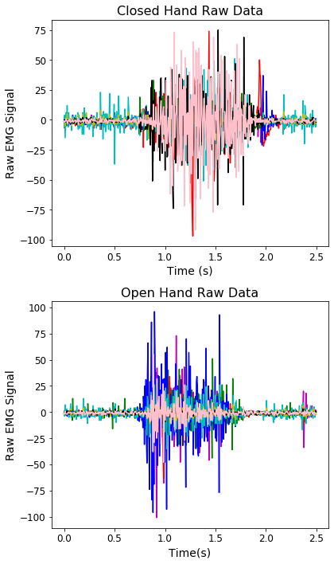
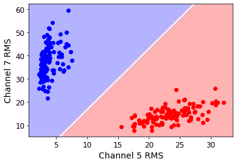
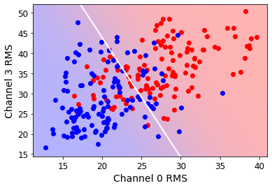

```python
%reset
%matplotlib inline
import matplotlib.pyplot as plt
from matplotlib import colors

#IPython is what you are using now to run the notebook
import IPython
print ("IPython version:      %6.6s (need at least 6.1.0)" % IPython.__version__)

# Numpy is a library for working with Arrays
import numpy as np
print ("Numpy version:        %6.6s (need at least 1.13.1)" % np.__version__)

# SciPy implements many different numerical algorithms
import scipy as sp
print ("SciPy version:        %6.6s (need at least 0.19.1)" % sp.__version__)

# Pandas makes working with data tables easier
import pandas as pd
print ("Pandas version:       %6.6s (need at least 0.20.3)" % pd.__version__)

# SciKit Learn implements several Machine Learning algorithms
import sklearn
from sklearn.discriminant_analysis import LinearDiscriminantAnalysis as LDA
print ("Scikit-Learn version: %6.6s (need at least 0.19.0)" % sklearn.__version__)

from itertools import combinations as cmb

# MNE is a package for processing (EEG) and (MEG) data 
#import mne
#print ("MNE version:          %6.6s (need at least 0.14.1)" % mne.__version__)
```

    Once deleted, variables cannot be recovered. Proceed (y/[n])?  y


    IPython version:       7.8.0 (need at least 6.1.0)
    Numpy version:        1.17.2 (need at least 1.13.1)
    SciPy version:         1.3.1 (need at least 0.19.1)
    Pandas version:       0.25.1 (need at least 0.20.3)
    Scikit-Learn version: 0.22.1 (need at least 0.19.0)


```python
# Colormap
cmap = colors.LinearSegmentedColormap(
    'red_blue_classes',
    {'red': [(0, 1, 1), (1, 0.7, 0.7)],
     'green': [(0, 0.7, 0.7), (1, 0.7, 0.7)],
     'blue': [(0, 0.7, 0.7), (1, 1, 1)]})
plt.cm.register_cmap(cmap=cmap)

# Set font sizes
SMALL_SIZE = 12
MEDIUM_SIZE = 14
BIGGER_SIZE = 16
plt.rc('font', size=SMALL_SIZE)          # controls default text sizes
plt.rc('axes', titlesize=SMALL_SIZE)     # fontsize of the axes title
plt.rc('axes', labelsize=MEDIUM_SIZE)    # fontsize of the x and y labels
plt.rc('xtick', labelsize=SMALL_SIZE)    # fontsize of the tick labels
plt.rc('ytick', labelsize=SMALL_SIZE)    # fontsize of the tick labels
plt.rc('legend', fontsize=SMALL_SIZE)    # legend fontsize
plt.rc('figure', titlesize=BIGGER_SIZE)  # fontsize of the figure title
```


```python
# import data
closed_full = np.loadtxt('./Close_hand_5x.csv',delimiter=';',usecols=range(8))
open_full = np.loadtxt('./Open_hand_5x.csv', delimiter=';',usecols=range(8))
held_closed = np.loadtxt('./Closed_30sec.csv',delimiter=';',usecols=range(8))
held_open = np.loadtxt('./Open_30sec.csv', delimiter=';',usecols=range(8))

# create time axes
closed_t = np.linspace(0,len(closed_full)/200, num=len(closed_full))
open_t = np.linspace(0,len(open_full)/200, num=len(open_full))
held_closed_t = np.linspace(0,len(held_closed)/200, num=len(held_closed))
held_open_t = np.linspace(0,len(held_open)/200, num=len(held_open))
```


```python
# plot closed-hand data
fig, ax = plt.subplots(2, 1)
fig.set_figheight(10)
fig.set_figwidth(6)
ax[0].plot(closed_t[:500],closed_full[:500,0], 'm-')
ax[0].plot(closed_t[:500],closed_full[:500,1], 'r-')
ax[0].plot(closed_t[:500],closed_full[:500,2], 'g-')
ax[0].plot(closed_t[:500],closed_full[:500,3], 'b-')
ax[0].plot(closed_t[:500],closed_full[:500,4], 'c-')
ax[0].plot(closed_t[:500],closed_full[:500,5], 'y-')
ax[0].plot(closed_t[:500],closed_full[:500,6], 'k-')
ax[0].plot(closed_t[:500],closed_full[:500,7], 'pink')
ax[0].set_title("Closed Hand Raw Data", fontsize=16)
ax[0].set_xlabel("Time (s)")
ax[0].set_ylabel("Raw EMG Signal")

# plot open-hand data
#ax[1].figure(2)
ax[1].plot(open_t[:500],open_full[:500,0], 'm-')
ax[1].plot(open_t[:500],open_full[:500,1], 'r-')
ax[1].plot(open_t[:500],open_full[:500,2], 'g-')
ax[1].plot(open_t[:500],open_full[:500,3], 'b-')
ax[1].plot(open_t[:500],open_full[:500,4], 'c-')
ax[1].plot(open_t[:500],open_full[:500,5], 'y-')
ax[1].plot(open_t[:500],open_full[:500,6], 'k-')
ax[1].plot(open_t[:500],open_full[:500,7], 'pink')
ax[1].set_title("Open Hand Raw Data", fontsize=16)
ax[1].set_xlabel("Time(s)")
ax[1].set_ylabel("Raw EMG Signal")  
fig.tight_layout()
fig.savefig("Open-Closed Raw Data.pdf",)
fig.show()
```

    /Users/ccs/opt/anaconda3/lib/python3.7/site-packages/ipykernel_launcher.py:32: UserWarning: Matplotlib is currently using module://ipykernel.pylab.backend_inline, which is a non-GUI backend, so cannot show the figure.





```python
# Calculates RMS's of 250ms chunks (for all channels)
def rms(data):
    output = np.zeros((8,120))
    for i in range(8):
        for j in range(120):
            low = j * 50
            high = low + 50
            output[i,j] = np.sqrt(np.mean(data[low:high,i]**2))
    return output
```


```python
# Perform calculation
closed_rms = rms(held_closed)
open_rms = rms(held_open)
```


```python
def lda_plt(cha, chb, class0, class1, fig):
    # Reformat data for LDA classifier
    closed_zipped = np.dstack((class0[cha,:], class0[chb,:]))
    open_zipped = np.dstack((class1[cha,:], class1[chb,:]))
    data = np.concatenate((closed_zipped, open_zipped), axis=1)[0]
    classes = np.concatenate((np.zeros(120), np.ones(120)))
    
    # Perform LDA
    lda = LDA()
    lda.fit(data, classes)

    # Plot points
    plt.figure(fig)
    plt.scatter(class0[cha,:],class0[chb,:], c='red')
    plt.scatter(class1[cha,:],class1[chb,:],c='blue')

    #plt.title("Closed vs. Open Hand \nLDA Decision Boundary",fontsize=16)
    plt.xlabel("Channel "+str(cha)+" RMS")
    plt.ylabel("Channel "+str(chb)+" RMS")

    # Plot class 0 and 1 areas
    nx, ny = 200, 100
    x_min, x_max = plt.xlim()
    y_min, y_max = plt.ylim()
    xx, yy = np.meshgrid(np.linspace(x_min, x_max, nx),
                         np.linspace(y_min, y_max, ny))
    Z = lda.predict_proba(np.c_[xx.ravel(), yy.ravel()])
    Z = Z[:, 1].reshape(xx.shape)
    plt.pcolormesh(xx, yy, Z, cmap='red_blue_classes',
                   norm=colors.Normalize(0., 1.), zorder=0)
    plt.contour(xx, yy, Z, [0.5], linewidths=2., colors='white')
    plt.savefig("2-Class LDA 0v3.pdf")


lda_plt(5,7,closed_rms,open_rms, 1)
lda_plt(0,3,closed_rms,open_rms, 2)
```








```python
def lda_eval(cha, chb, class0, class1):
    # Reformat data for LDA classifier
    closed_zipped = np.dstack((class0[cha,:], class0[chb,:], np.zeros(120)))
    open_zipped = np.dstack((class1[cha,:], class1[chb,:], np.ones(120)))
    data = np.concatenate((closed_zipped, open_zipped), axis=1)[0]
    np.random.shuffle(data)
    classes = data[:,2]
    data = data[:,:2]
    
    # Separate training data
    t_data = data[:int(len(data)*0.25)]
    t_classes = classes[:int(len(classes)*0.25)]
    
    # Separate validation data
    v_data = data[int(len(data)*0.25):]
    v_classes = classes[int(len(classes)*0.25):]
    
    # Perform LDA
    lda = LDA()
    lda.fit(t_data, t_classes)
    
    pred = lda.predict(v_data)
    num_correct = 0
    for i,p in enumerate(pred):
        if v_classes[i] == p:
            num_correct += 1
    pos_rate = num_correct/len(v_classes)
    return pos_rate
    
lda_eval(0,3,closed_rms,open_rms)
```


    0.7944444444444444


```python
# Get all permutations of feature combinations
combs = list(cmb(np.arange(8),2))

# Evaluate each obtained combination 
results = np.zeros((len(combs),3))
for i,(cha,chb) in enumerate(combs): 
    tpr = lda_eval(cha, chb, closed_rms, open_rms)
    results[i,0] = cha
    results[i,1] = chb
    results[i,2] = tpr

print(results)
```

    [[0.         1.         0.92222222]
     [0.         2.         0.98333333]
     [0.         3.         0.76666667]
     [0.         4.         0.93888889]
     [0.         5.         1.        ]
     [0.         6.         1.        ]
     [0.         7.         1.        ]
     [1.         2.         0.93888889]
     [1.         3.         0.94444444]
     [1.         4.         1.        ]
     [1.         5.         1.        ]
     [1.         6.         1.        ]
     [1.         7.         0.97777778]
     [2.         3.         0.99444444]
     [2.         4.         1.        ]
     [2.         5.         1.        ]
     [2.         6.         1.        ]
     [2.         7.         0.99444444]
     [3.         4.         0.97222222]
     [3.         5.         1.        ]
     [3.         6.         0.99444444]
     [3.         7.         1.        ]
     [4.         5.         1.        ]
     [4.         6.         0.99444444]
     [4.         7.         1.        ]
     [5.         6.         1.        ]
     [5.         7.         1.        ]
     [6.         7.         1.        ]]


```python
print(np.average(results[:,2]))
print(np.std(results[:,2]))
```

    0.9793650793650794
    0.04659615664471649


```python

```
